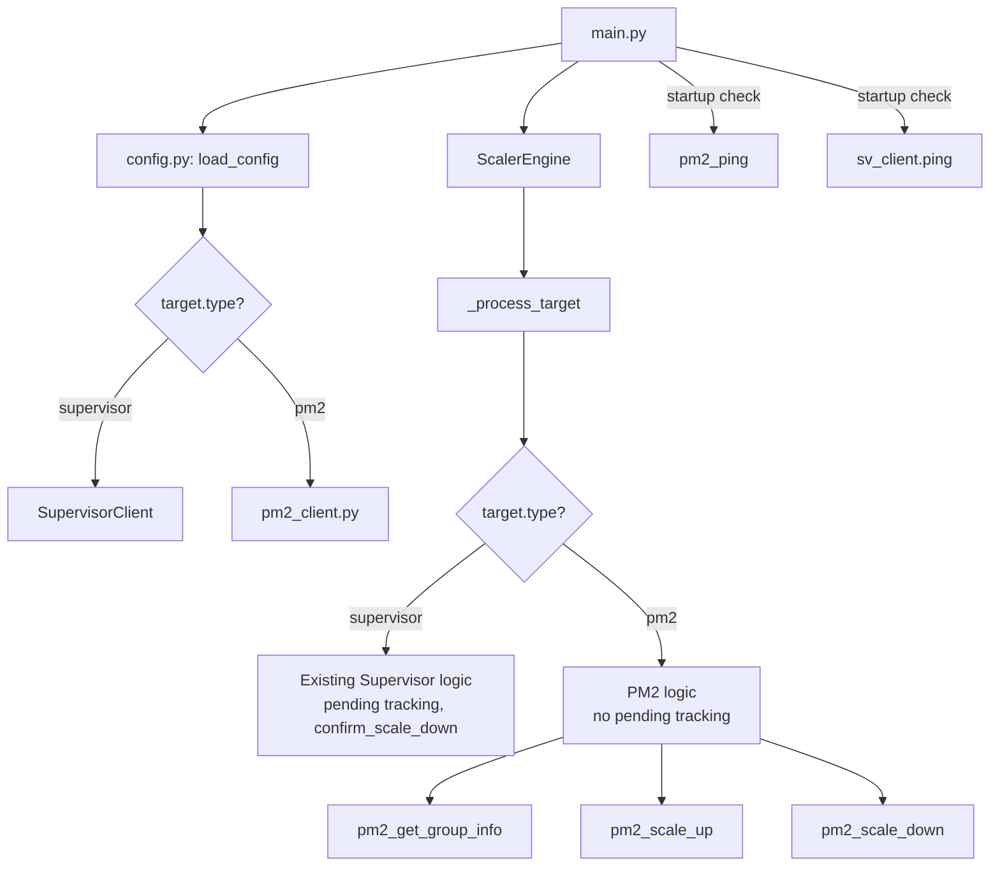

# Design Document: PM2 Integration

## Overview

This design adds PM2 process manager support to Superscaler alongside the existing Supervisor backend. The approach is deliberately minimal: a `type` field is added to each `[target:*]` config section, and `ScalerEngine._process_target` dispatches to either the existing Supervisor path or new PM2 helper functions based on that field.

No abstract base classes, no engine refactor, no new `[manager]` section. PM2 commands (`pm2 scale`, `pm2 jlist`, `pm2 ping`) are executed via `subprocess.run` from a small helper module.

### Key Design Decisions

1. **Dispatch in `_process_target`, not a ProcessManager ABC** — The user explicitly wants no abstraction layer. A simple `if target.type == 'pm2'` branch keeps the change small and avoids touching the Supervisor path.

2. **No pending state tracking for PM2** — PM2's `pm2 scale` removes processes synchronously, unlike Supervisor which requires a stop-then-confirm dance. The PM2 branch skips the `pending` list entirely.

3. **PM2 helper functions in a separate module** — `src/superscaler/pm2_client.py` keeps PM2 subprocess logic isolated from the scaling engine, making it easy to test and mock.

4. **Optional PM2 execution environment fields** — `pm2_path`, `pm2_home`, `run_as_user` are all optional with sensible defaults (global `pm2` binary, no custom home, no sudo). This covers the common case where PM2 is installed globally and superscaler runs as root.

5. **Supervisor section remains required only when supervisor targets exist** — The `[supervisor]` section validation is relaxed to only fail when at least one target has `type = supervisor`.

## Architecture



### File Changes

| File | Change |
|------|--------|
| `src/superscaler/pm2_client.py` | **New file.** Helper functions: `pm2_ping`, `pm2_get_group_info`, `pm2_scale_up`, `pm2_scale_down`. All use `subprocess.run`. |
| `src/superscaler/config.py` | Add `type`, `pm2_path`, `pm2_home`, `run_as_user` fields to `TargetConfig`. Update `load_config` parsing. Relax `[supervisor]` section requirement. |
| `src/superscaler/scaler.py` | Split `_process_target` into supervisor and PM2 branches. Import pm2_client functions. |
| `src/superscaler/main.py` | Add PM2 ping check at startup. Add `pm2_path` existence check. Make supervisor ping conditional. |
| `packaging/superscaler.service` | Remove `supervisord.service` and `supervisor.service` from `After=` directive. The service must work standalone regardless of which process manager backends are configured. Users may run PM2-only without Supervisor installed. Updated line: `After=network.target`. |

## Components and Interfaces

### pm2_client.py — PM2 CLI Helper Module

All functions accept execution environment parameters (`pm2_path`, `pm2_home`, `run_as_user`) to build the correct subprocess command.

```python
def _build_pm2_cmd(args: list[str], pm2_path: str = '', 
                   pm2_home: str = '', run_as_user: str = '') -> tuple[list[str], dict]:
    """Build the subprocess command list and env dict for a PM2 call.
    
    Returns (cmd, env) where cmd is the full command list and env is
    the environment dict (or None if no modifications needed).
    """
```

```python
PM2_STATUS_MAP = {
    'online': 'RUNNING',
    'stopping': 'STOPPING',
    'stopped': 'STOPPED',
    'errored': 'FATAL',
    'launching': 'STARTING',
}

def pm2_ping(pm2_path: str = '', pm2_home: str = '', 
             run_as_user: str = '') -> bool:
    """Return True if PM2 daemon is reachable (exit code 0)."""

def pm2_get_group_info(program_name: str, pm2_path: str = '', 
                       pm2_home: str = '', run_as_user: str = '') -> dict:
    """Run `pm2 jlist`, filter by program_name, return dict matching
    SupervisorClient.get_group_info format:
    {'count': int, 'processes': [{'name': str, 'pid': int, 'state': int, 'statename': str}, ...]}
    """

def pm2_scale_up(program_name: str, count: int, pm2_path: str = '', 
                 pm2_home: str = '', run_as_user: str = '') -> list[str]:
    """Run `pm2 scale <program_name> +<count>`.
    Returns list of newly added process names by diffing jlist before/after.
    Raises on non-zero exit code.
    """

def pm2_scale_down(program_name: str, desired_count: int, pm2_path: str = '', 
                   pm2_home: str = '', run_as_user: str = '') -> list[str]:
    """Run `pm2 scale <program_name> <desired_count>`.
    Returns list of removed process names by diffing jlist before/after.
    Raises on non-zero exit code.
    """
```

### config.py — Updated TargetConfig

```python
@dataclasses.dataclass
class TargetConfig:
    name: str
    type: str               # 'supervisor' or 'pm2', default 'supervisor'
    queue: str
    queue_key: str
    program_name: str
    poll_interval: int
    tasks_per_worker: int
    min_workers: int
    max_workers: int
    scale_up_step: int
    scale_down_step: int
    cooldown_up: int
    cooldown_down: int
    pm2_path: str            # default '' (use 'pm2' from PATH)
    pm2_home: str            # default '' (no custom PM2_HOME)
    run_as_user: str         # default '' (no sudo)
```

### scaler.py — _process_target Dispatch

The existing `_process_target` method is renamed to `_process_supervisor_target` (keeping all its logic intact). A new `_process_pm2_target` method handles PM2 targets. The `_process_target` method becomes a thin dispatcher:

```python
def _process_target(self, target, state, now):
    if target.type == 'pm2':
        self._process_pm2_target(target, state, now)
    else:
        self._process_supervisor_target(target, state, now)
```

#### `_process_pm2_target` — Parameter Usage

The `_process_pm2_target` method uses ALL existing target parameters identically to the supervisor path:

| Parameter | PM2 Behavior (identical to Supervisor path) |
|-----------|----------------------------------------------|
| `program_name` | The PM2 app name passed to `pm2 scale`, `pm2 jlist` filtering |
| `poll_interval` | Same polling interval — target is skipped if less than `poll_interval` seconds since last tick |
| `tasks_per_worker` | Same desired worker calculation: `desired = ceil(queue_len / tasks_per_worker)` |
| `min_workers` | Same lower bound: `desired = max(min_workers, desired)` |
| `max_workers` | Same upper bound: `desired = min(max_workers, desired)`, and scale-up capped at `max_workers - current` |
| `scale_up_step` | Same step limit: `count = min(scale_up_step, max_workers - current)` |
| `scale_down_step` | Same step limit: `count = min(scale_down_step, active - min_workers)` |
| `cooldown_up` | Same cooldown timer: scale-up blocked if `now - last_up < cooldown_up` |
| `cooldown_down` | Same cooldown timer: scale-down blocked if `now - last_down < cooldown_down` |

The only difference from the supervisor path is that PM2 targets skip pending state tracking (PM2 removes processes synchronously) and call `pm2_client` functions instead of `SupervisorClient` methods.

### main.py — Startup Changes

```python
# Conditional supervisor setup
has_supervisor_targets = any(t.type == 'supervisor' for t in config.targets)
has_pm2_targets = any(t.type == 'pm2' for t in config.targets)

if has_supervisor_targets:
    sv_client = SupervisorClient(...)
    if not sv_client.ping():
        logger.error(...)
        sys.exit(1)
else:
    sv_client = None

if has_pm2_targets:
    # Verify pm2_path for targets that set it
    for t in config.targets:
        if t.type == 'pm2' and t.pm2_path:
            if not os.path.isfile(t.pm2_path) or not os.access(t.pm2_path, os.X_OK):
                logger.error('pm2_path %r for target %r does not exist or is not executable', 
                             t.pm2_path, t.name)
                sys.exit(1)
    # Ping PM2 using first PM2 target's settings
    first_pm2 = next(t for t in config.targets if t.type == 'pm2')
    if not pm2_ping(first_pm2.pm2_path, first_pm2.pm2_home, first_pm2.run_as_user):
        logger.error('Cannot connect to PM2')
        sys.exit(1)
```

## Data Models

### TargetConfig Changes

| Field | Type | Default | Description |
|-------|------|---------|-------------|
| `type` | `str` | `'supervisor'` | Process manager type: `supervisor` or `pm2` |
| `pm2_path` | `str` | `''` | Full path to PM2 binary. Empty = use `pm2` from PATH |
| `pm2_home` | `str` | `''` | PM2_HOME directory. Empty = use PM2 default |
| `run_as_user` | `str` | `''` | OS user for `sudo -u`. Empty = run as current user |

### PM2 Status Mapping

| PM2 Status | ScalerEngine Statename | Notes |
|------------|----------------------|-------|
| `online` | `RUNNING` | Active, counted as worker |
| `launching` | `STARTING` | Active, counted as worker |
| `stopping` | `STOPPING` | Not active, not stopped |
| `stopped` | `STOPPED` | Stopped |
| `errored` | `FATAL` | Stopped |

### PM2 jlist Output Structure (relevant fields)

```json
[
  {
    "name": "my-worker",
    "pm_id": 0,
    "pid": 12345,
    "pm2_env": {
      "status": "online"
    }
  }
]
```

The `pm2_get_group_info` function filters this list by `name == program_name` and maps each entry to the `{'name': str, 'pid': int, 'state': int, 'statename': str}` format used by the existing Supervisor path.

### Systemd Service File Change

The current `packaging/superscaler.service` has `After=network.target supervisord.service supervisor.service`. Since users may run PM2-only without Supervisor installed, the service file must not hard-depend on Supervisor services. The `After=` directive is updated to:

```ini
[Unit]
Description=Superscaler for autoscaling worker processes
After=network.target
```

This ensures the service starts cleanly regardless of which process manager backends are configured.

### Config File Example

```ini
[supervisor]
unix_socket_path = unix:///var/run/supervisor.sock
username =
password =

[queue:main-redis]
type = redis
host = 127.0.0.1
port = 6379
password =
db = 0

; Supervisor target — works exactly as before
[target:web-workers]
type = supervisor
queue = main-redis
queue_key = web-tasks
program_name = web-worker
tasks_per_worker = 50
min_workers = 2
max_workers = 10

; PM2 target — all scaling parameters work identically
[target:node-workers]
type = pm2
queue = main-redis
queue_key = node-tasks
program_name = my-node-app
tasks_per_worker = 20
min_workers = 1
max_workers = 8
poll_interval = 5
scale_up_step = 2
scale_down_step = 1
cooldown_up = 15
cooldown_down = 30
pm2_path = /usr/local/bin/pm2
pm2_home = /home/deploy/.pm2
run_as_user = deploy
```


## Correctness Properties

*A property is a characteristic or behavior that should hold true across all valid executions of a system — essentially, a formal statement about what the system should do. Properties serve as the bridge between human-readable specifications and machine-verifiable correctness guarantees.*

### Property 1: Config type field validation

*For any* string value assigned to the `type` field in a `[target:*]` section, `load_config` should accept it if and only if the value is `supervisor` or `pm2`. When the field is omitted, the parsed `TargetConfig.type` should equal `supervisor`. When the value is anything else, `load_config` should raise a `ValueError`.

**Validates: Requirements 1.1, 1.2, 1.3**

### Property 2: PM2 optional config fields parsing

*For any* valid `[target:*]` section with `type = pm2`, the fields `pm2_path`, `pm2_home`, and `run_as_user` should be parsed as optional strings. When omitted, each should default to an empty string in the resulting `TargetConfig`.

**Validates: Requirements 9.1, 9.2, 9.3, 9.4**

### Property 3: PM2 command building

*For any* combination of `pm2_path` (empty or non-empty), `pm2_home` (empty or non-empty), `run_as_user` (empty or non-empty), and a list of PM2 arguments, `_build_pm2_cmd` should produce a command list where: (a) the PM2 binary is `pm2_path` if non-empty, else `pm2`; (b) the command is prefixed with `sudo -u <run_as_user>` if `run_as_user` is non-empty; (c) the returned environment includes `PM2_HOME=<pm2_home>` if `pm2_home` is non-empty.

**Validates: Requirements 3.1, 4.1, 9.5, 9.6, 9.7, 9.8**

### Property 4: pm2_get_group_info parsing and filtering

*For any* valid JSON array representing `pm2 jlist` output containing processes with mixed `name` values and PM2 statuses, `pm2_get_group_info(program_name)` should return only processes whose `name` matches `program_name`, with each PM2 status correctly mapped (`online`→`RUNNING`, `launching`→`STARTING`, `stopping`→`STOPPING`, `stopped`→`STOPPED`, `errored`→`FATAL`), and the result should have `count` equal to the length of the `processes` list.

**Validates: Requirements 5.1, 5.2, 5.3, 5.4, 8.4**

### Property 5: PM2 subprocess non-zero exit raises exception

*For any* PM2 helper function call (`pm2_scale_up`, `pm2_scale_down`, `pm2_get_group_info`) where the underlying subprocess exits with a non-zero code, the function should raise an exception.

**Validates: Requirements 3.2, 4.3, 5.5**

### Property 6: No pending state tracking for PM2 targets

*For any* PM2 target that undergoes a scale-down operation, the target's `pending` list in `ScalerEngine._state` should remain empty after the operation completes.

**Validates: Requirements 4.2, 7.3**

### Property 7: Scaling logic preserved for both target types

*For any* target (supervisor or PM2) with configured cooldown timers, step limits, and min/max worker bounds, the ScalerEngine should enforce: (a) scale-up count ≤ `scale_up_step`; (b) scale-down count ≤ `scale_down_step`; (c) active workers never scaled below `min_workers`; (d) total workers never scaled above `max_workers`; (e) cooldown timers prevent consecutive operations within the cooldown period.

**Validates: Requirements 7.4**

### Property 8: Scale up returns added process names via diff

*For any* `pm2_scale_up` call where the subprocess succeeds, the returned list should contain exactly the process names that appear in the post-scale `pm2 jlist` output but not in the pre-scale output, for the given `program_name`.

**Validates: Requirements 8.5**

### Property 9: PM2 ping maps exit code to boolean

*For any* exit code returned by the `pm2 ping` subprocess, `pm2_ping` should return `True` if the exit code is 0, and `False` for any non-zero exit code.

**Validates: Requirements 8.6**

### Property 10: Warning for PM2 fields on supervisor targets

*For any* `[target:*]` section with `type = supervisor` that also sets `pm2_path`, `pm2_home`, or `run_as_user` to a non-empty value, `load_config` should log a warning indicating these parameters are ignored.

**Validates: Requirements 9.11**

### Property 11: Supervisor targets use SupervisorClient with pending tracking

*For any* target with `type = supervisor`, when `_process_target` is called, the engine should invoke `SupervisorClient` methods (`get_group_info`, `scale_up`, `scale_down`, `confirm_scale_down`) and should populate the `pending` list after scale-down operations.

**Validates: Requirements 2.1, 2.2, 7.2**

### Property 12: Supervisor section required only when supervisor targets exist

*For any* configuration file, the `[supervisor]` section should be required if and only if at least one `[target:*]` section has `type = supervisor` (or `type` omitted). A config with only `type = pm2` targets should load successfully without a `[supervisor]` section.

**Validates: Requirements 2.3**

## Error Handling

| Scenario | Behavior |
|----------|----------|
| `pm2 jlist` returns invalid JSON | `pm2_get_group_info` raises exception; `_process_pm2_target` catches it, logs warning, skips tick |
| `pm2 scale` exits non-zero | `pm2_scale_up`/`pm2_scale_down` raise `subprocess.CalledProcessError`; engine catches, logs error, skips action |
| `pm2 ping` fails at startup | `main.py` logs error and exits with code 1 |
| `pm2_path` not found or not executable | `main.py` logs error with path and target name, exits with code 1 |
| `subprocess.run` times out | `subprocess.TimeoutExpired` propagates; engine catches, logs error, skips tick |
| PM2 fields set on supervisor target | `load_config` logs warning but continues loading |
| Invalid `type` value in config | `load_config` raises `ValueError` with supported types listed |
| No `[supervisor]` section but supervisor targets exist | `load_config` raises `ValueError` |
| No `[supervisor]` section, only PM2 targets | Config loads successfully |
| `pm2 jlist` returns process with unknown status | Map to `UNKNOWN` statename, do not count as active |

### Subprocess Timeout

All PM2 subprocess calls use a default timeout of 30 seconds. This prevents the scaling loop from hanging if PM2 becomes unresponsive. The timeout is a constant in `pm2_client.py` (`PM2_TIMEOUT = 30`).

## Testing Strategy

### Property-Based Testing

Use `hypothesis` as the property-based testing library (Python ecosystem, well-suited for this project).

Each correctness property from the design document maps to a single property-based test. Tests should run a minimum of 100 iterations each.

Each test must be tagged with a comment referencing the design property:
```python
# Feature: pm2-integration, Property 1: Config type field validation
```

Key properties to implement as property-based tests:

1. **Config type validation** (Property 1) — Generate random strings, verify only `supervisor`/`pm2` are accepted, omission defaults to `supervisor`.
2. **PM2 optional fields parsing** (Property 2) — Generate configs with random combinations of pm2_path/pm2_home/run_as_user, verify defaults.
3. **Command building** (Property 3) — Generate random combinations of pm2_path, pm2_home, run_as_user, and args. Verify command structure.
4. **jlist parsing and filtering** (Property 4) — Generate random JSON arrays with mixed process names and statuses. Verify filtering and mapping.
5. **Non-zero exit raises** (Property 5) — Generate random non-zero exit codes, verify exception raised.
6. **No pending for PM2** (Property 6) — Generate random PM2 targets and scale-down scenarios, verify pending stays empty.
7. **Scaling bounds** (Property 7) — Generate random scaling parameters and queue lengths, verify bounds are respected.
8. **Scale up diff** (Property 8) — Generate random before/after process lists, verify diff correctness.
9. **Ping exit code mapping** (Property 9) — Generate random exit codes, verify boolean mapping.
10. **Warning on supervisor+PM2 fields** (Property 10) — Generate supervisor targets with random PM2 field values, verify warning logged.
11. **Supervisor dispatch** (Property 11) — Generate supervisor targets, verify SupervisorClient methods called with pending tracking.
12. **Supervisor section conditional** (Property 12) — Generate configs with various target type combinations, verify [supervisor] section requirement.

### Unit Tests

Unit tests complement property tests by covering specific examples, integration points, and edge cases:

- **Config parsing**: Specific config file examples with PM2 targets, mixed targets, supervisor-only targets.
- **PM2 startup checks**: `pm2_ping` called when PM2 targets exist, not called when only supervisor targets.
- **`pm2_path` validation**: Specific examples of missing/non-executable paths.
- **Status mapping edge cases**: Unknown PM2 statuses mapped to `UNKNOWN`.
- **Empty jlist output**: No processes returned for a program_name that doesn't exist in PM2.
- **Config reload**: SIGHUP with PM2 targets added/removed.
- **Integration**: End-to-end tick with mocked subprocess for PM2 target alongside mocked SupervisorClient for supervisor target.

### Test File Organization

```
tests/
  test_pm2_client.py          # Unit + property tests for pm2_client.py
  test_config_pm2.py           # Unit + property tests for config.py PM2 changes
  test_scaler_pm2.py           # Unit + property tests for scaler.py PM2 dispatch
  test_main_pm2.py             # Unit tests for main.py PM2 startup checks
```
